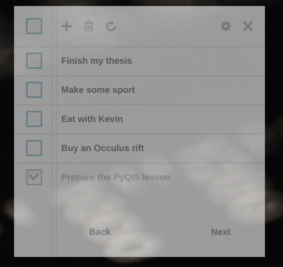

# todo App
simple todo application designed for the [pyconfr2016](https://2016.pycon.fr/) using PyQt5 and QML.

  

# Installation 
## Server
Todo Server is a flask application using mongodb . You need both of them to make it work. 
From ubuntu : 
	
	sudo apt-get install mongodb 

Then install dependencies and run: 

	pip3 install -r server/requirements.txt
	python3 server/app.py

## Client 
Todo Client is a pyQt5.7 client made with pure QML. Other module are note used. 
To install dependencies and run : 

	pip3 install -r client/requirements.txt
	python3 client/app.py

